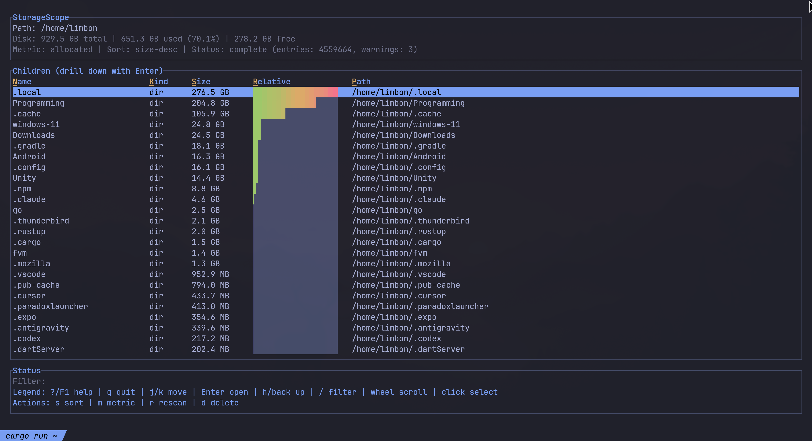

# StorageScope

TreeSize-like terminal disk usage analyzer for Linux terminals.



## Features

- Fast incremental scanning with live updates while traversal is running.
- Directory-focused view optimized for large trees.
- Relative usage bars with gradient rendering and live loading indicators.
- Sort by size/name and switch metric (`allocated` / `apparent`).
- Persistent navigation cache when drilling into folders.
- Keyboard + mouse navigation.
- Omarchy-aware theme detection with live theme reload.
- Disk capacity header (`total`, `used`, `free`).
- Safe delete flow with typed confirmation (`DELETE`).

## Run

```bash
cargo run -- .
```

Common examples:

```bash
# scan home
cargo run -- ~

# very large tree: keep UI responsive
cargo run -- / --show-files false --max-depth 4
```

## CLI

```bash
storagescope [PATH] [--one-file-system true|false] [--follow-symlinks true|false] [--show-hidden true|false] [--show-files true|false] [--metric allocated|apparent] [--max-depth N] [--no-delete]
```

## Keybindings

- `j` / `k` or arrows: move selection
- `Enter`: open selected directory
- `h` / `Backspace`: go to parent directory
- `s`: cycle sort mode
- `m`: toggle metric (`allocated` / `apparent`)
- `r`: rescan current path
- `/`: filter by name/path
- `Shift+N`: toggle Name column
- `Shift+K`: toggle Kind column
- `Shift+S`: toggle Size column (`s` is still sort)
- `Shift+R`: toggle Relative column
- `Shift+P`: toggle Path column
- `?` / `F1`: open help modal
- mouse wheel: move selection
- left click: select row
- double left click: open selected directory
- right click in table: go to parent directory
- `d`: delete selected entry (unless `--no-delete`)
- `q`: quit

## Performance Tips

- For large roots (`/`, big home directories), prefer `--show-files false`.
- Use `--max-depth` for quick exploratory scans.
- Keep `--one-file-system true` if you do not need cross-mount traversal.

## Safety

Delete is intentionally guarded with a typed `DELETE` confirmation. Disable delete entirely with `--no-delete`.

## Contributing

Contributions are welcome. See [`CONTRIBUTING.md`](CONTRIBUTING.md).

AI-assisted contributions are explicitly allowed; contributor responsibility rules are documented there.

## Releases

Release workflow is documented in [`RELEASING.md`](RELEASING.md).
